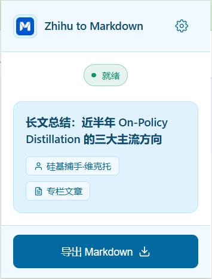
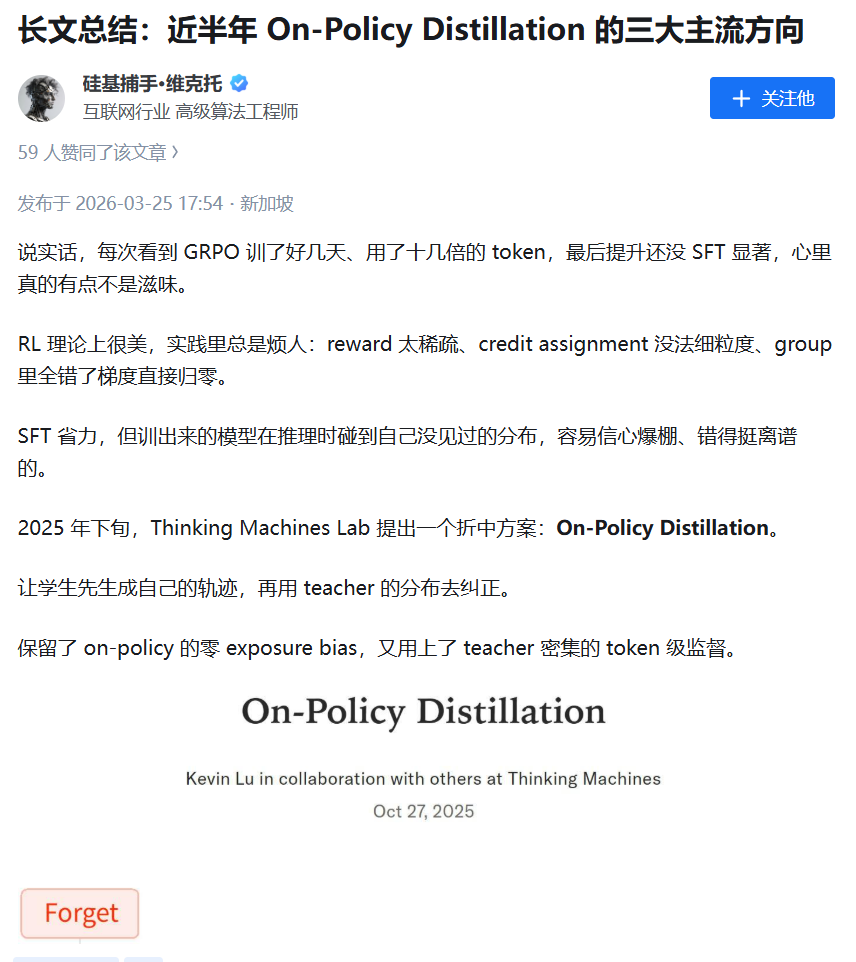
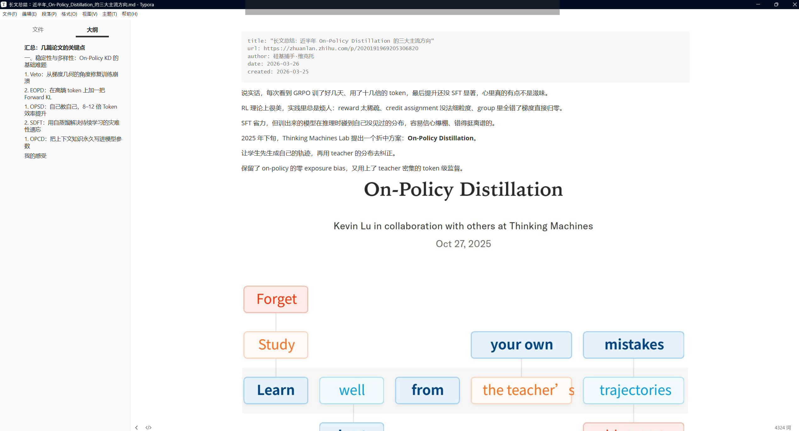
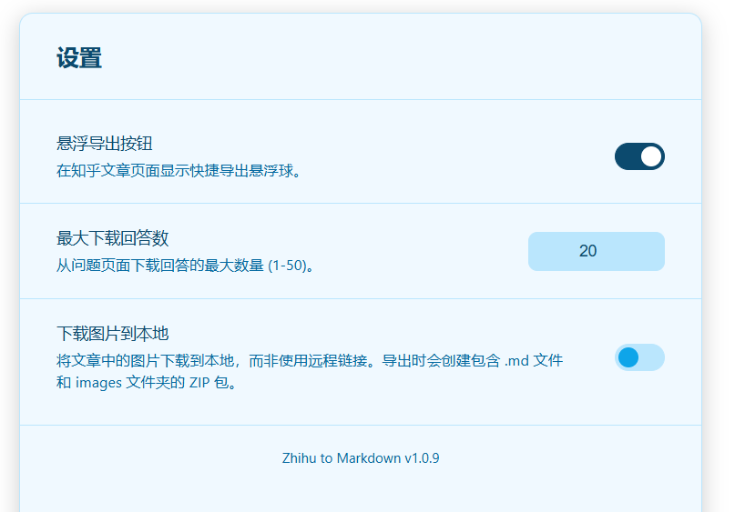
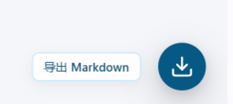

# Zhihu to Markdown

<div align="center">

将知乎内容尽可能完整地导出为 Markdown 的 Chrome 扩展。  
支持专栏、回答、问题页多回答、首页推荐、关注动态和热榜导出。

[](https://chromewebstore.google.com/detail/zhihu-md/heeilejdelmogpbnbbhdokgfabmhkenh?authuser=0&hl=zh-CN)
[](./LICENSE)
[](./manifest.json)

[Chrome Web Store](https://chromewebstore.google.com/detail/zhihu-md/heeilejdelmogpbnbbhdokgfabmhkenh?authuser=0&hl=zh-CN)
•
[功能特性](#功能特性)
•
[界面截图](#界面截图)
•
[快速开始](#快速开始)
•
[使用说明](#使用说明)
•
[项目结构](#项目结构)
•
[隐私说明](./PRIVACY.md)
•
[License](./LICENSE)

</div>

## 项目简介

知乎上有很多值得保存的内容，但复制出来往往很乱：

- 公式会丢
- 图片链接不干净
- 代码块格式容易坏
- 问题页、首页流、热榜这类页面很难整理

这个项目的目标很直接：把你眼前的知乎页面整理成一份能继续写、继续存、继续发布的 Markdown 文件。

它不是爬虫，不做账号绕过，也不试图拿到你看不到的内容。它做的事情只有一件：把当前页面中已经加载出来的知乎内容，尽量干净地导出下来。

## 功能特性

### 支持的页面类型

- 专栏文章：`https://zhuanlan.zhihu.com/p/...`
- 单条回答：`https://www.zhihu.com/question/.../answer/...`
- 问题页：批量导出多个回答
- 首页推荐：导出信息流内容
- 关注动态：导出关注页内容
- 热榜页：导出热榜标题、链接和热度信息

### 导出效果

- 保留正文结构，输出为标准 Markdown
- 自动生成 YAML Front Matter
- 公式转为 `$...$` / `$$...$$`
- 代码块保留语言标识
- 知乎链接卡片降级为普通 Markdown 链接
- 图片可使用远程链接，也可以导出为本地图片包
- 自动清理非法文件名字符，减少下载失败

### 使用体验

- 弹出窗口中直接识别当前页面类型
- 可选页面悬浮导出按钮
- 问题页支持设置最大回答导出数量
- 首页、关注页会自动滚动加载后再导出
- 热榜页可以快速整理成清单文档

## 界面截图

### 1. 弹出面板



### 2. 导出结果示例

原始页面：



导出后的 Markdown 结果：



### 3. 设置页面



### 4. 页面悬浮球



## 快速开始

### 方式一：从 Chrome Web Store 安装

直接安装即可：

<a href="https://chromewebstore.google.com/detail/zhihu-md/heeilejdelmogpbnbbhdokgfabmhkenh?authuser=0&hl=zh-CN">
  
</a>

安装完成后：

1. 打开任意支持的知乎页面
2. 点击浏览器工具栏里的扩展图标
3. 点击 `导出 Markdown`

### 方式二：开发者模式加载

```bash
git clone https://github.com/Tendo33/zhihu-md.git
cd zhihu-md
```

然后在 Chrome 中：

1. 打开 `chrome://extensions/`
2. 打开右上角的“开发者模式”
3. 点击“加载已解压的扩展程序”
4. 选择当前项目根目录

## 使用说明

### 导出专栏或单条回答

进入文章页或回答页后，点击扩展图标即可直接导出当前内容。

适合这些场景：

- 收藏自己写过的内容
- 整理资料到 Obsidian、Typora、Notion
- 迁移到博客、知识库或 GitHub 仓库

### 导出问题页多个回答

进入问题页后，扩展会自动向下滚动并收集回答，再导出为单个 Markdown 文件。

导出结果会按回答顺序整理，包含：

- 回答作者
- 创建时间
- 编辑时间
- 回答正文

### 导出首页推荐或关注动态

如果你想把一段时间内刷到的内容保存下来，这两个页面会比较有用。

扩展会在页面中自动加载内容，然后按顺序导出为 Markdown 列表，适合做：

- 日常阅读归档
- 选题收集
- 热门内容回顾

### 导出热榜

热榜导出更偏清单型结果，适合快速保存标题、链接和热度信息，后续再做二次整理。

## 配置项

扩展提供独立设置页，目前支持以下选项：

| 配置项 | 说明 | 默认值 |
| --- | --- | --- |
| 悬浮导出按钮 | 在知乎页面右下角显示快捷导出按钮 | 开启 |
| 最大下载回答数 | 问题页最多导出多少条回答，`0` 表示不限数量 | `20` |
| 下载图片到本地 | 导出时将图片打包到本地，而不是保留远程链接 | 关闭 |

### 关于图片下载

开启“下载图片到本地”后，导出结果不是单独的 `.md` 文件，而是一个 ZIP 包，里面通常包含：

- 1 个 Markdown 文件
- 1 个 `images/` 目录

这样离线查看会更方便，也更适合归档。

## 输出格式示例

单篇文章或单条回答导出时，文件顶部会自动附带元信息：

```yaml
---
title: "示例标题"
url: https://www.zhihu.com/question/...
author: 作者名
date: 2026-03-26
created: 2025-12-01
edited: 2025-12-03
---
```

问题页多回答导出时，会额外记录回答数量，并按章节整理每条回答。

## 适合谁用

- 想把知乎内容整理进本地知识库的人
- 想备份自己文章和回答的人
- 想把知乎内容二次编辑成博客或文档的人
- 想快速归档首页推荐、关注流或热榜的人

## 项目结构

```text
zhihu-md/
├── manifest.json                  # Chrome 扩展清单
├── background/
│   └── background.js              # 下载与图片打包逻辑
├── content/
│   ├── content.js                 # 内容脚本入口
│   ├── content.css                # 页面注入样式
│   └── modules/
│       ├── constants.js           # 共享常量与工具函数
│       ├── detector.js            # 页面类型识别
│       ├── floating-ball.js       # 悬浮导出按钮
│       ├── turndown-rules.js      # Markdown 转换规则
│       └── exporters/
│           ├── article.js         # 专栏 / 回答导出
│           ├── question.js        # 问题页多回答导出
│           ├── feed.js            # 首页 / 关注页导出
│           └── hot.js             # 热榜导出
├── popup/
│   ├── popup.html                 # 弹出面板
│   ├── popup.css                  # 弹出面板样式
│   └── popup.js                   # 弹出面板逻辑
├── options/
│   ├── options.html               # 设置页
│   ├── options.css                # 设置页样式
│   └── options.js                 # 设置项持久化
├── lib/
│   ├── turndown.min.js            # HTML 转 Markdown 依赖
│   ├── logger.js                  # 日志工具
│   ├── init-scheduler.js          # 初始化调度
│   ├── page-detector.js           # 页面识别辅助
│   └── shared.css                 # 共享样式
├── icons/                         # 扩展图标
├── scripts/
│   └── package.js                 # 打包脚本
├── dist/                          # 打包产物
├── PRIVACY.md                     # 隐私说明
└── README.md
```

## 本地开发

### 打包扩展

```bash
npm run package
```

执行后会在 `dist/` 下生成可上传到 Chrome Web Store 的 ZIP 包。

## 已知限制

- 只能导出当前页面已经加载出来的内容
- 付费内容、折叠内容或未展开内容，能否导出取决于页面当前是否可见
- 默认不抓取评论区
- 页面结构如果被知乎改动，部分选择器可能需要更新
- 首页和关注页属于动态信息流，导出结果会受当时页面加载状态影响

## 隐私说明

这个扩展只在 `*.zhihu.com` 页面工作，使用到的权限也比较克制：

- `activeTab`：读取当前标签页内容
- `downloads`：保存导出的文件
- `storage`：保存扩展设置

详细说明见 [PRIVACY.md](./PRIVACY.md)。

## License

本项目基于 [MIT License](./LICENSE) 开源。
